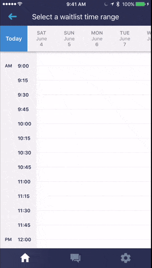

# AppointmentWaitlist-iOS
iOS appointment waitlist for an interview code challenge for my friend's company.

I was tasked to implement this

I had very little information outside of the image and was instructed to just freestyle whatever.
The json calls are specific for his REST api. Any other URL will just trigger the test data.

Sort of hacked together, so there is definitely room for improvement.

#Demo
